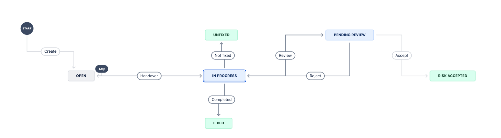
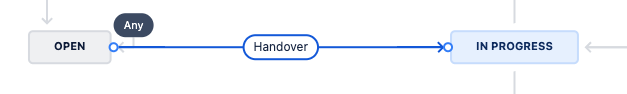
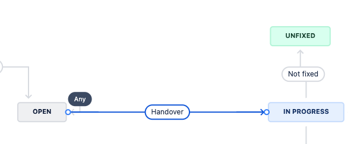
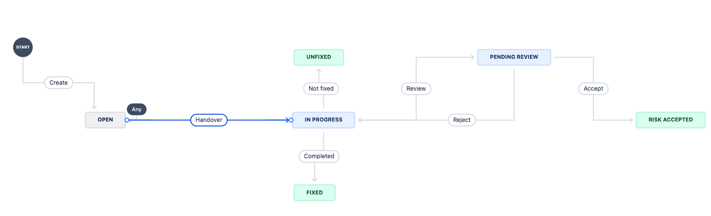
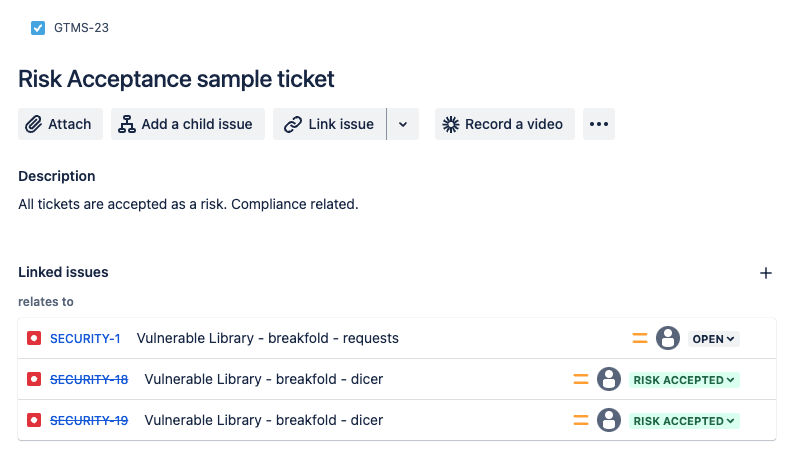
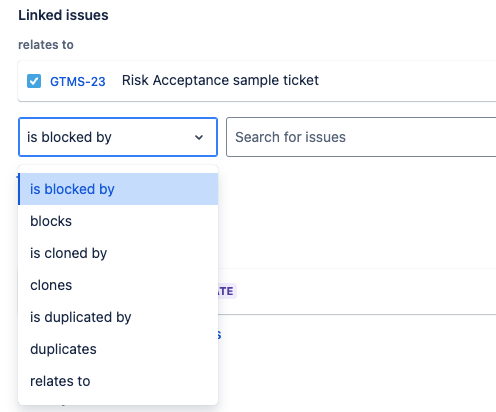
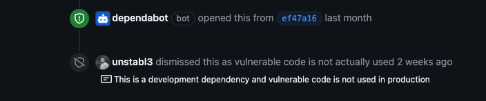
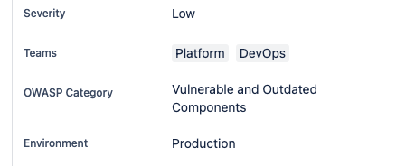

### Advanced Configuration

This document provides detailed descriptions for each key in the `Advanced.json` configuration file used by DependAssist, along with explanations of what happens when certain flags are set to true or false.

### Configuration Keys

#### `github`
  - **org_name**: 
    - **Description**: The name of your GitHub organization.
    - **Example**: `"org_name": "your_github_org"`

#### `settings`
  - **repo_file**:
    - **Description**: The name of the file that contains the list of repositories to be processed.
    - **Example**: `"repo_file": "repos.txt"`
  - **cutoff_days**:
    - **Description**: The number of days to look back for Dependabot alerts. If you are running DependAssist for the first time and want to create jira tickets for all previous alerts keep cutoff_days as per your alerts age.
    - **Example**: `"cutoff_days": 65`

#### `jira`
  - **server**:
    - **Description**: The URL of your JIRA server.
    - **Example**: `"server": "https://yourdomain.atlassian.net"`
  - **project_key**:
    - **Description**: The key of the JIRA project where the tickets will be created. Check [Basic_configuration](Basic_configuration.md) for how to find the project keys.
    - **Example**: `"project_key": "SECURITY"`
  - **issuetype**:
    - **Description**: The type of issue to be created in JIRA. Check [Basic_configuration](Basic_configuration.md) for how to find the project keys.
    - **Example**: `"issuetype": "Bug"`
  - **status_values**:
    - **Description**: A list of status values used to filter JIRA issues. This key is crucial for preventing the creation of duplicate tickets by DependAssist. It ensures that the script can search for existing tickets before creating new ones. Note that a single package can have multiple Dependabot alerts, so using the correct status values helps in managing these alerts effectively.
    - **Example**: `"status_values": ["In Progress", "Open", "Pending Review"]`
    - **Note**: Ensure that these status values match the workflow statuses used in your JIRA project to avoid duplication and maintain consistency. DependAssist will search for previously created issues in mentioned workflow status_values.
      
  - **process_jira_tickets**:
    - **Description**: A boolean flag indicating whether JIRA tickets should be processed after creation. When set to true, DependAssist can add comments, transition the ticket to the next workflow step, and link it to another specified ticket.
    - **Example**: `"process_jira_tickets": true`
    - **Behavior**:
        - **true**: The script will move the JIRA tickets through the defined workflow states after creation.
        - **false**: The script will create the tickets but will not perform any transitions.
  - **Workflow States**:
    - **normal**:
        - **Purpose**: Used for runtime dependency tickets.
        - **Lifecycle**: The ticket will transition through the specified states in order. Please view the screenshot below
        - **Example**:
         ```json
         "normal": ["Open", "Handover"]
         ```
        - **Explanation**: 
            - **Open**: The initial state when a ticket is created.
            - **Handover**: The ticket is handed over to the relevant team or individual for further action.

            

    - **dev_dependency**:
        - **Purpose**: Used for development dependency tickets. Since development dependencies are not used in production the risk is very low. There is no need of fixing these alerts. DependAssist will automatically dismiss dependabot alert from Github after jira ticket creation.
        - **Lifecycle**: The ticket will transition through the specified states in order.
        - **Example**:
         ```json
         "dev_dependency": ["Open", "Handover", "Not fixed"]
         ```
        - **Explanation**:
            - **Open**: The initial state when a ticket is created.
            - **Handover**: The ticket is handed over to the relevant team or individual for further action.
            - **Not fixed**: The ticket is marked as not fixed, indicating that no action is required because it’s a development dependency.
           
            

    - **risk_accepted**:
        - **Purpose**: Used for tickets where the risk is accepted.
        - **Lifecycle**: The ticket will transition through the specified states in order.
        - **Example**:
        ```json
        "risk_accepted": ["Open", "Handover", "Review", "Accept"]
        ```
        - **Explanation**:
            - **Open**: The initial state when a ticket is created.
            - **Handover**: The ticket is handed over to the relevant team or individual for review.
            - **Review**: The ticket is reviewed for risk assessment.
            - **Accept**: The risk is accepted, and the ticket is marked as "Risk Accepted".
 
            

    - **Important Notes**:
        - **Order Matters**: Ensure that the states are listed in the correct order as they represent the step-by-step progression of the ticket.
        - **Matching JIRA Workflow**: The specified states must match the actual workflow statuses in your JIRA project. This is crucial for DependAssist to transition tickets correctly.

          By defining the workflow states in the correct order, DependAssist can effectively manage the lifecycle of each ticket type, ensuring that each ticket follows the appropriate path from creation to resolution.

  - **link_issue**:
    - **Description**: A boolean flag to indicate whether issues should be linked. This is important when you have different ticket that keeps track of all Risk Accepted tickets.
    - **Example**: `"link_issue": false`
    - **Behavior**:
        - **true**: The script will link newly created issues to an existing parent issue specified by `outward_issue_key`. This only happens when ticket is marked as Risk Accepted.
        - **false**: No issue linking will be performed.
    - **outward_issue_key**:
        - **Description**: The key of the issue to which new issues should be linked. Even if the issue is on different project board it will work.
        - **Example**: `"outward_issue_key": "GTMS-23"`

        

    - **link_type**:
        - **Description**: The type of link to be created between issues.
        - **Example**: `"link_type": "Relates"`
        - **Reference**: You can find the value sutiable for you on "https://yourdomain.atlassian.net/rest/api/3/issueLinkType"
        

  - **dismiss_no_patch**:
    - **Description**: A boolean flag to indicate whether alerts with no available patches should be dismissed from GitHub.
    - **Example**: `"dismiss_no_patch": true`
    - **Behavior**:
        - **true**: Alerts for which no patch is available will be automatically dismissed.
        - **false**: Alerts for which no patch is available will remain open.

          

  - **custom_fields**:
    - **Description**: Custom fields to be included in JIRA tickets. Each custom field should have an ID. This is one of the most important configuration if your JIRA admin have created additional fields for jira tickets. These fields may include severity, teams, service, OWASP Category, Found by Team etc. These customfields usually will contain static values. For example OWASP category will always remain "Vulnerable and Outdated Components" for dependabot alerts.
    - **Example**:
      ```json
      "custom_fields": {
        "customfield_10036": { "id": "10029" },
        "customfield_10037": { "id": ["10030", "10031"] }
      }
      ```
         

         **If properly configure, these customfields can be set automatically with DependAssist.** Please see the example above.

    - **Reference**: All customfields values are accessible via https://yourdomain.atlassian.net/rest/api/2/issue/SECURITY-6/editmeta

  - **auto_severity**:
    - **Description**: A boolean flag to indicate whether automatic severity assignment should be used.
    - **Example**: `"auto_severity": false`
    - **Behavior**:
        - **true**: The script will calculate the severity of the issue based on CVSS score, EPSS score, and KEV status, and assign the appropriate value to the custom severity field.
        - **false**: The script will use the hardcoded severity value provided in `custom_fields`.

  - **team_field_id**:
    - **Description**: The custom field ID for assigning teams in JIRA. User has to give correct IDs for each teams in team_mappings.
    - **Example**: `"team_field_id": "customfield_10038"`
  - **team_mapping_file**:
    - **Description**: The path to the JSON file that contains the mapping of GitHub repositories to team IDs. For example, if you have a github repository "Thor" and the team which owns this repository is "Marvel" then find the ID which points to the marvel value in jira.
    - **Example**: `"team_mapping_file": "team_mapping.json"`
    - **Reference**: You can visit any open ticket from your jira session to get all information related to customfields. Every value for each customfield has its own ID. https://yourdomain.atlassian.net/rest/api/2/issue/SECURITY-6/editmeta
  - **team_mapping.json**:
    - **Description**: This file contains the mapping of GitHub repositories to team IDs. The team IDs should match the custom field ID provided in `team_field_id`. This allows the script to dynamically assign the correct team based on the repository.
    - **Example**:
      ```json
      {
        "Thor": "10050",
        "repo2": ["10051", "10052"],
        "repo3": "10053",
        "repo4": ["10054", "10055"]
      }
      ```

### Example Configuration File

```json
{
  "github": {
    "org_name": "unstabl3"
  },
  "settings": {
    "repo_file": "repos.txt",
    "cutoff_days": 65
  },
  "jira": {
    "server": "https://yourdomain.atlassian.net",
    "project_key": "SECURITY",
    "issuetype": "Bug",
    "status_values": ["In Progress", "Open", "Pending Review"],
    "process_jira_tickets": true,
    "workflow_states": {
      "normal": ["Open", "Handover"],
      "dev_dependency": ["Open", "Handover", "Not fixed"],
      "risk_accepted": ["Open", "Handover", "Review", "Accept"]
    },
    "link_issue": false,
    "outward_issue_key": "GTMS-23",
    "link_type": "Relates",
    "dismiss_no_patch": true,
    "custom_fields": {
      "customfield_10036": { "id": "10029" },
      "customfield_10037": { "id": ["10030", "10031"] }
    },
    "auto_severity": false,
    "severity_fields": {
      "customfield_10036": {
        "values": {
          "P4": "10029",
          "P3": "10028",
          "P2": "10027",
          "P1": "10026"
        }
      }
    }
  }
}
```
