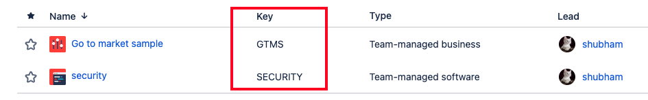
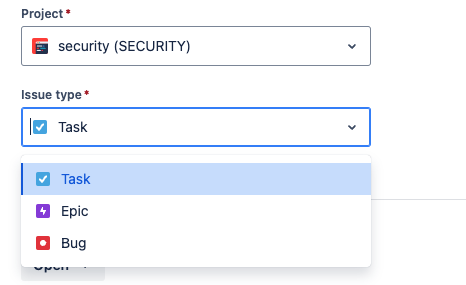

### Basic Configuration

The basic configuration provided with this GitHub repository is responsible for creating tickets in JIRA with the minimum JIRA requirements. When creating JIRA tickets, the following fields are typically required:

- Summary
- Project Key
- Description
- Issue Type

These fields are automatically fetched from the configuration file and from GitHub. Make sure to read [Sensitive Tokens](Sensitive_tokens.md) page to configure credentials.

### Required Fields

#### Summary
DependAssist generates a summary for JIRA tickets using a predefined format for clarity and brevity:
```
Vulnerable Library - [repository-name] - [vulnerable package name]
```

#### Project Key
The Project Key refers to the board where the issue will be created. You can find the Project Key by visiting the following URL in your JIRA web UI:
```
https://yourdomain.atlassian.net/jira/projects
```



#### Issue Type
Common issue types for creating vulnerability tickets are "Security Bug" or "Bug". The specific issue type can be found and configured in your JIRA settings.



#### Description
DependAssist creates the JIRA ticket by fetching the description of the vulnerability from GitHub. This ensures that the ticket contains all necessary details about the vulnerability.

### Configuration File
The configuration file (`basic.json`) should include the following fields to automate the ticket creation process:

```json
{
  "github": {
    "org_name": "your_github_org"
  },
  "settings": {
    "repo_file": "repos.txt",
    "cutoff_days": 65
  },
  "jira": {
    "server": "https://yourdomain.atlassian.net",
    "project_key": "PROJECT_KEY",
    "issuetype": "Bug",
    "status_values": ["In Progress", "Open", "Pending Review"]
  }
}
```

By following this configuration, DependAssist will create JIRA tickets with all the required fields, ensuring a smooth integration between GitHub and JIRA.
