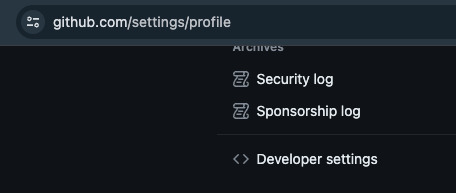
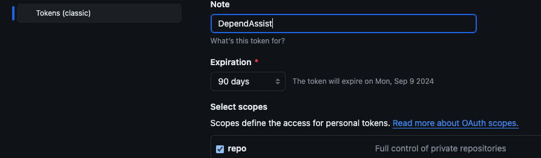

To use the `DependAssist` script, you need a GitHub API key with the necessary permissions.

### Steps to Create GitHub API Key

#### 1. Log in to GitHub

- Go to [GitHub](https://github.com) and log in.

#### 2. Navigate to Developer Settings

- Click on your profile picture in the top right.
- Select **Settings**.
- In the sidebar, click on **Developer settings**.

#### 3. Create a New Personal Access Token

- Click on **Personal access tokens**.
- Click on **Tokens (classic)**.
- Click **Generate new token**.
- Give your token a descriptive name, such as `DependAssist`.

#### 4. Set Permissions

- Select the following minimum scopes:
  - `repo`: Full control of private repositories.
- Click **Generate token**.

#### 5. Copy and Store the Token

Refer to the [Sensitive Tokens](Sensitive_tokens.md) page for instructions on storing your API key securely using a `.env` file or environment variables.

You can now use this API key to authenticate the DependAssist script.
