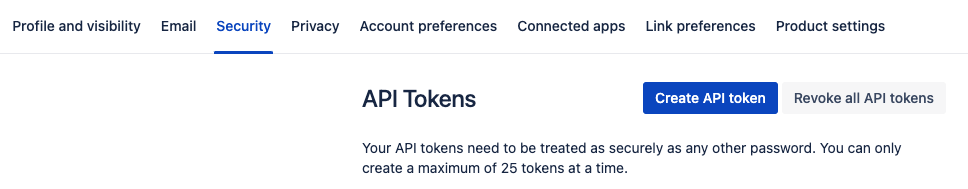

To use the `DependAssist` script, you need a JIRA API key with the necessary permissions.

### Steps to Create JIRA API Key

#### 1. Log in to JIRA

- Go to your JIRA instance and log in.

#### 2. Navigate to API Tokens

- Click on your avatar (profile picture) at the bottom left.
- Select **Account settings**.
- In the sidebar, click on **Security**.
- Scroll down to **API token** and click on **Create and manage API tokens**.

#### 3. Create API Token

- Click on **Create API token**.
- Give your token a label, such as `DependAssist`.
- Click **Create**.
- Copy the generated API token and store it securely.

#### 4. Storing the API Key

Refer to the [Sensitive Tokens](Sensitive_tokens.md) page for instructions on storing your API key securely using a `.env` file or environment variables.

By following these steps, you can create and manage a JIRA API key to authenticate the `DependAssist` script effectively.
