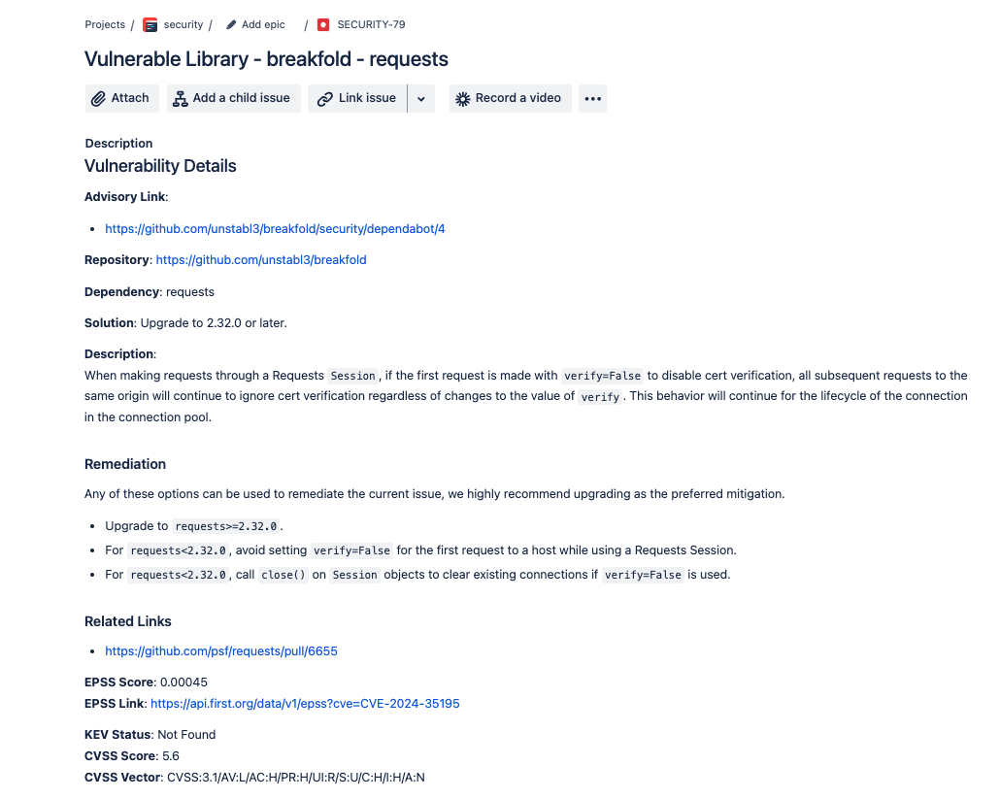
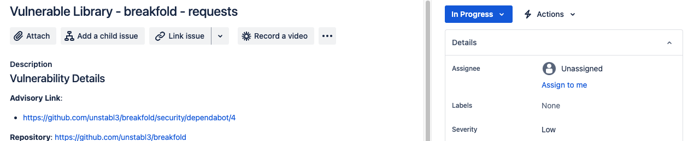
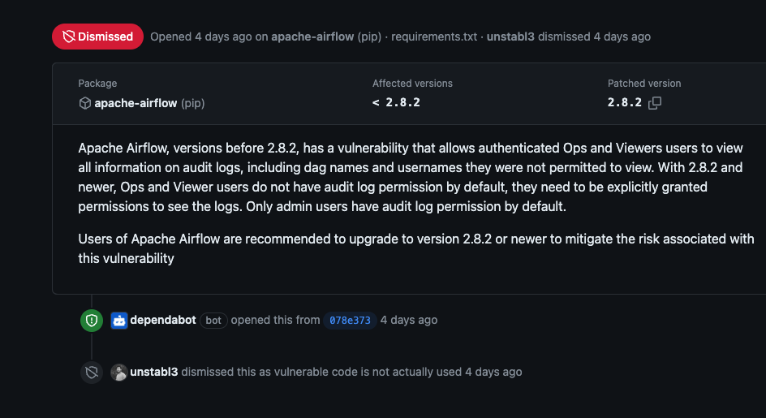

# DependAssist in Action

This page showcases some screenshots of DependAssist performing its tasks. These examples will give you a visual understanding of how DependAssist integrates with JIRA and GitHub to streamline dependency management.

## 1. Creating a JIRA Ticket

DependAssist will create a new JIRA ticket for a Dependabot alert like shown in the below image:

## 2. Automatic Severity Assignment

DependAssist assigning severity to a JIRA ticket based on the CVSS score, EPSS score, and KEV status:

## 3. Dismissing Alerts in GitHub

DependAssist dismissing processed alerts in GitHub:

